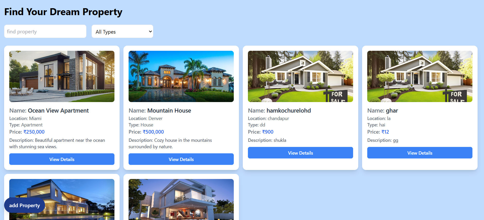

🏠 Mini Property Listing Dashboard

A sleek and interactive dashboard to view, add, edit, and manage property listings. Built to demonstrate CRUD operations, responsive design, and frontend-backend integration.

✨ Features
```
View Listings – See all properties with details like name, location, price, and image.

Add Property – Quickly add new listings through a simple form.

Edit & Delete – Update or remove properties with ease.

Responsive Design – Fully functional on desktop and mobile screens.
```





🛠️ Tech Stack
```
Frontend: React.js, HTML, CSS / Tailwind CSS

Backend: Node.js, Express.js

Database: MongoDB

Others: Axios, React Router
```
🚀 Installation
```
Clone the repo

git clone https://github.com/tulsishuka/Dream-Property.git

cd folder
npm install

Run the frontend

npm run dev

Run the backend

cd backend
json-server --watch db.json --port 3000
```
🎯 Usage
```
Open http://localhost:3000 in your browser.

Browse properties on the dashboard.

Add new listings using the Add Property form.

Edit or delete existing properties easily.
```

📂 Project Structure
```
Dream-Property/
├─ frontend/      # React components & pages
├─ backend/       # Express API & MongoDB models
└─ README.md      # Project documentation
```
